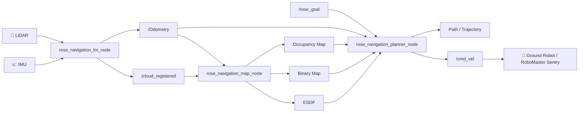
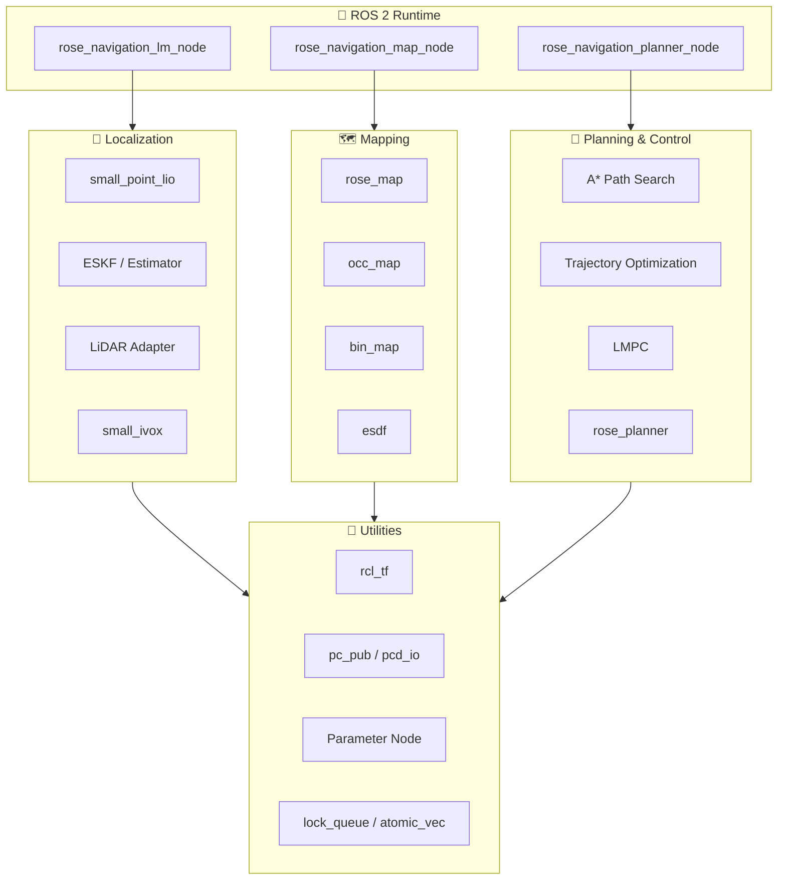

<div align="center">

# 🌹 ROSE NAVIGATION

**面向地面机器人与 RoboMaster 哨兵机器人的 ROS 2 导航栈**

<p>
  
  
  
  
</p>

<p>
  
  
  
</p>

<p>
  
  
  
</p>

</div>

---

<div align="center">

持续开发中。


</div>

---

# 📌 项目简介

ROSE NAVIGATION 是一个面向小型地面机器人的 ROS 2 导航框架。

项目围绕 RoboMaster 哨兵机器人等高速移动平台设计，提供：

- LiDAR-Inertial 定位
- 局部地图构建
- ESDF 环境表示
- A* 路径搜索
- 轨迹优化
- MPC 控制输出

支持从传感器输入到机器人运动控制的完整导航链路。

---

# 📑 目录

- [✨ 亮点](#亮点)
- [🧩 功能模块](#功能模块)
- [📦 依赖](#依赖)
- [⚡ Quick Start](#quick-start)
- [🚀 启动节点](#启动节点)
- [📡 话题与服务](#话题与服务)
- [⚙️ 配置文件](#配置文件)
- [🔄 数据流图](#数据流图)
- [🏗 软件架构](#软件架构)
- [📂 文件结构](#文件结构)
- [🙏 致谢](#致谢)

---

# ✨ 亮点

- **定位、建图、规划一体化**

  包含轻量 LiDAR-Inertial Odometry、局部占据地图、二值地形地图、ESDF 以及路径规划控制链路。

  可作为完整导航栈使用，也可以按模块单独接入现有机器人系统。

---

- **面向小型高速地面平台**

  规划器围绕 RoboMaster 哨兵机器人和全向移动底盘设计：

  - 高频重规划
  - 动态障碍更新
  - 速度预测
  - MPC 控制输出

---

- **模块化 ROS 2 架构**

  定位、地图、规划、控制模块通过 ROS 2 Topic / Service 解耦：

  - 易于调试
  - 易于替换算法
  - 支持不同机器人平台部署

---

# 🧩 功能模块

| 模块 | 节点入口 | 说明 |
| :--- | :--- | :--- |
| LiDAR-Inertial 定位 | `rose_navigation_lm_node` | 订阅 LiDAR 与 IMU，输出里程计、配准点云和定位调试 Marker |
| 地图构建 | `rose_navigation_map_node` | 根据里程计和点云维护局部占据地图、二值地图与 ESDF |
| 规划控制 | `rose_navigation_planner_node` | 接收目标点，执行 A* 搜索、轨迹优化和 MPC 控制，输出 `/cmd_vel` |

---

# 📦 依赖

## 🖥 基础环境

- Ubuntu 22.04
- ROS 2 Humble
- CMake 3.8+
- C++20 编译器


---

## 🤖 ROS 2 与系统库

- `ament_cmake_auto`
- `rclcpp`
- `rclcpp_components`
- `rclpy`
- `sensor_msgs`
- `geometry_msgs`
- `nav_msgs`
- `nav2_msgs`
- `tf2_ros`
- `tf2_geometry_msgs`
- `std_srvs`
- `std_msgs`
- `visualization_msgs`

数学与优化库：

- `Eigen3`
- `OpenCV`
- `yaml-cpp`
- `TBB`
- `OSQP`
- `OsqpEigen`

---

# ⚡ Quick Start

## 📥 安装常用依赖

```bash
sudo apt update

sudo apt install -y \
    ros-humble-desktop \
    ros-humble-tf2-ros \
    ros-humble-tf2-geometry-msgs \
    ros-humble-nav2-msgs \
    libeigen3-dev \
    libopencv-dev \
    libyaml-cpp-dev \
    libtbb-dev \
    libosqp-dev
```

> `OsqpEigen` 需要从源码安装。

---

## 🔨 构建

在 ROS 2 工作空间根目录执行：

```bash
cd /home/hy/rose_nav

source /opt/ros/humble/setup.bash

colcon build \
    --packages-select rose_navigation \
    --symlink-install

source install/setup.bash
```

---

# 🚀 启动节点

## 📡 启动 MID-360 定位

```bash
ros2 launch rose_navigation mid360_lm.launch.py
```

默认配置：

```text
config/mid360_lm.yaml
```

### 输入

| Topic | 说明 |
| :--- | :--- |
| `/livox/lidar` | LiDAR 点云 |
| `/livox/imu` | IMU 数据 |

### 输出

| Topic | 说明 |
| :--- | :--- |
| `/Odometry` | 机器人里程计 |
| `/cloud_registered` | 配准后的点云 |
| `/lm_marker` | 定位调试 Marker |

---

## 🗺 启动地图节点

```bash
ros2 launch rose_navigation rose_map.launch.py
```

默认配置：

```text
config/rose_map.yaml
```

地图节点订阅：

```text
/Odometry
/cloud_registered
```

输出：

- 局部占据地图
- 二值地图
- ESDF 调试点云
- `map` 栅格地图

---

## 🧭 启动规划节点

```bash
ros2 launch rose_navigation rose_planner.launch.py
```

默认配置：

```text
config/rose_planner.yaml
```

规划节点：

输入：

```text
/Odometry
/rose_goal
```

输出：

```text
/cmd_vel
```

包含：

- A* 路径搜索
- 轨迹优化
- MPC 控制
- 路径可视化

---

## 🎯 发布目标点

支持：

- `geometry_msgs/msg/PoseStamped`
- `geometry_msgs/msg/PointStamped`

示例：

```bash
ros2 topic pub --once \
/rose_goal \
geometry_msgs/msg/PoseStamped \
"{
  header: {
    frame_id: 'map'
  },
  pose: {
    position: {
      x: 1.0,
      y: 1.0,
      z: 0.0
    },
    orientation: {
      w: 1.0
    }
  }
}"
```

或使用Rviz2插件进行发布

---

# 📡 话题与服务

## 📥 主要订阅

| 节点 | Topic | 类型 | 说明 |
| :--- | :--- | :--- | :--- |
| `rose_navigation_lm_node` | `/livox/lidar` | `sensor_msgs/msg/PointCloud2` 或 Livox 自定义消息 | LiDAR 输入，具体类型由 `lidar_type` 决定 |
| `rose_navigation_lm_node` | `/livox/imu` | `sensor_msgs/msg/Imu` | IMU 输入 |
| `rose_navigation_map_node` | `/Odometry` | `nav_msgs/msg/Odometry` | 当前机器人位姿 |
| `rose_navigation_map_node` | `/cloud_registered` | `sensor_msgs/msg/PointCloud2` | 配准后的点云 |
| `rose_navigation_planner_node` | `/Odometry` | `nav_msgs/msg/Odometry` | 当前机器人位姿和速度 |
| `rose_navigation_planner_node` | `/rose_goal` | `geometry_msgs/msg/PoseStamped` / `PointStamped` | 导航目标点 |

---

## 📤 主要发布

| 节点 | Topic | 类型 | 说明 |
| :--- | :--- | :--- | :--- |
| `rose_navigation_lm_node` | `/Odometry` | `nav_msgs/msg/Odometry` | 定位输出 |
| `rose_navigation_lm_node` | `/cloud_registered` | `sensor_msgs/msg/PointCloud2` | 配准点云 |
| `rose_navigation_map_node` | `map` | `nav_msgs/msg/OccupancyGrid` | 2D 栅格地图 |
| `rose_navigation_map_node` | `occ_map_out` / `acc_map_out` / `esdf_out` | `sensor_msgs/msg/PointCloud2` | 占据地图、累积地图和 ESDF 调试点云 |
| `rose_navigation_planner_node` | `/cmd_vel` | `geometry_msgs/msg/Twist` | 底盘速度控制指令 |
| `rose_navigation_planner_node` | `/cmd_vel_norm` | `std_msgs/msg/Float64` | 控制速度模长 |
| `rose_navigation_planner_node` | `raw_path` / `opt_path` / `old_path` / `predict_path` | `nav_msgs/msg/Path` | 路径、优化轨迹和预测轨迹 |
| `rose_navigation_planner_node` | `/vel_marker` / `/now_state_marker` / `/opt_traj_marker` / `/tunnel_marker` | `visualization_msgs` | RViz2 调试可视化 |

---

## 🔧 服务

| 节点 | Service | 类型 | 说明 |
| :--- | :--- | :--- | :--- |
| `rose_navigation_lm_node` | `map_save` | `std_srvs/srv/Trigger` | 保存定位模块维护的点云地图 |
| `rose_navigation_lm_node` | `reset` | `std_srvs/srv/Trigger` | 重置定位状态 |
| `rose_navigation_lm_node` | `algin` | `std_srvs/srv/Trigger` | 切换先验点云对齐状态 |
| `rose_navigation_map_node` | `add_static` | `std_srvs/srv/Trigger` | 将当前地图控制为静态 |

查看当前服务：

```bash
ros2 service list | grep rose
```

> 服务名可能受节点命名空间影响。

---

# ⚙️ 配置文件

配置文件位于：

```text
config/
├── mid360_lm.yaml
├── rose_map.yaml
└── rose_planner.yaml
```

---

## 📄 配置说明

| 文件 | 说明 |
| :--- | :--- |
| `mid360_lm.yaml` | LiDAR/IMU 话题、雷达类型、点云滤波、IMU 噪声、外参、先验点云对齐等定位参数 |
| `rose_map.yaml` | 地图输入话题、目标坐标系、局部地图尺寸、占据栅格更新、静态地图路径、ESDF 参数 |
| `rose_planner.yaml` | 机器人半径、目标话题、规划频率、A* 权重、轨迹优化、MPC 控制参数以及内置地图参数 |

---

## 🔧 常用配置调整

### 仿真 / 实车切换

真实机器人运行：

```yaml
use_sim_time: false
```

---

### 静态地图

修改：

```yaml
static_map_path
```

为当前场地地图路径。

---

### 机器人尺寸

根据实际底盘调整：

```yaml
robot_radius
safe_radius

bottom_z_to_robo_z
top_z_to_robo_z
```

---

### 控制参数

根据底盘性能调整：

```yaml
max_speed
max_accel
default_wz
```

以及 MPC 权重。

---

# 🔄 数据流图



---

# 🏗 软件架构

ROSE NAVIGATION 采用 ROS 2 组件化架构：



---

# 📂 文件结构

```text
rose_navigation
│
├── CMakeLists.txt
├── package.xml
│
├── config
│   ├── mid360_lm.yaml
│   ├── rose_map.yaml
│   └── rose_planner.yaml
│
├── launch
│   ├── mid360_lm.launch.py
│   ├── rose_map.launch.py
│   └── rose_planner.launch.py
│
├── src
│
│   ├── lm
│   │   ├── small_point_lio.*
│   │   ├── estimator.*
│   │   └── lidar_adapter
│   │
│   ├── map
│   │   ├── rose_map.*
│   │   ├── occ_map.*
│   │   ├── bin_map.hpp
│   │   └── esdf.*
│   │
│   ├── planner
│   │   ├── rose_planner.*
│   │   ├── path_search
│   │   ├── traj_opt
│   │   └── control
│   │
│   └── utils
│
└── 3rdparty
    ├── backward-cpp
    └── lbfgs.hpp
```

---

# 🙏 致谢

本项目在设计与实现过程中参考了以下优秀开源项目。

感谢所有机器人、SLAM、规划方向开发者的开源贡献。

---

| 模块 | 参考项目 | 说明 |
| :--- | :--- | :--- |
| LiDAR-Inertial 定位 | [small_point_lio](https://github.com/Yancey2023/small_point_lio) | `lm` 模块深度参考其轻量 LiDAR-Inertial Odometry 实现 |
| 局部地图 | [ROG-Map](https://github.com/hku-mars/ROG-Map) | `map` 模块参考其占据地图和局部地图更新思想 |
| 规划与轨迹优化 | [DDR-opt](https://github.com/ZJU-FAST-Lab/DDR-opt) | `planner` 模块参考其路径规划与轨迹优化方法 |
| RoboMaster 仿真环境 | [rmu_gazebo_simulator](https://github.com/SMBU-PolarBear-Robotics-Team/rmu_gazebo_simulator) | 项目开发和调试过程中使用的 RoboMaster 仿真环境 |

---

